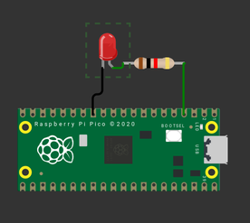

# Exercício 1

Uma das principais funções de um micro-controlador é ser capaz de acionar (e por conta disso, controlar) o mundo real, e uma das formas mais básicas que temos para fazer isso é via um pino de saída digital, na qual via software podemos controlar se ele vai estar em `0` (sem energia) ou em `1` (energizado)!

## Código

Para configurar um pino como saída use:

```c
gpio_init(PIN);
gpio_set_dir(PIN, GPIO_OUT);
```

E para controlar o pino use:

``` c
gpio_put(PIN, 1); // para ativar
gpio_put(PIN, 0); // para desativar
```

## Tarefa

Modifique o código `main.c` para fazer o LED acender e apagar trocando o estado a cada `250ms` (ele vai piscar!).

> Indicamos para vocês testarem primeiro online no wokwi e depois validam no CI.

| Diagrama         |                     |
|------------------|-------------------------------------------------------------------|
|  | [Open in in wokwi](https://wokwi.com/projects/382395689125209089) |

### Cenário de teste

O teste verifica se o LED começa apagado e se acende depois de `250ms`
