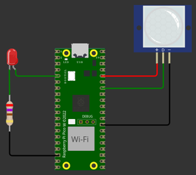

# Exercício 2

Além de saídas difitais, microcontroladores possuem entradas digitais, onde podemos ler informações geradas pelo mundo externo (informações que podem ser tratadas como `0` ou `1`). 

## Código

Para configurar um pino como entrada use:

```c
gpio_init(PIN);
gpio_set_dir(PIN, GPIO_IN);
```

E para ler o valor use:

``` c
gpio_get(PIN)
```

## Tarefa

Modifique o código `main.c` para fazer leitura do sensor de movimento [pir](https://docs.wokwi.com/pt-BR/parts/wokwi-pir-motion-sensor) e acionar o LED sempre que o sensor detectar um movimento (`d=1`), quando não existir mais movimento (`d=0`) o LED deve ser desligado. 

> Indicamos para vocês testarem primeiro online no wokwi e depois validam no CI.

| Diagrama         |                     |
|------------------|-------------------------------------------------------------------|
|  | [Open in in wokwi](https://wokwi.com/projects/382387982947858433) |

### Cenário de teste

O teste aciona em um determinado momento o sensor de movimento e verifica se o LED acende quando existir movimento e apaga quando não mais houver.
