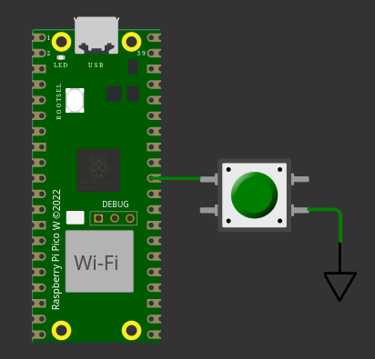

# Exercício 4

Botões são sistemas eletromecânicos e geram uma oscilação quando são pressionados, se a oscilação não for tratada a nível de hardware ou de software ela pode ser interpretada como se o usuário tivesse apertado o botão diversas vezes, quando na verdade apertou apenas uma!

Veja o sinal a seguir capturado de um botão senso apertado e repare que o valor oscila antes de estabilizar no valor `0` para quando foi apertado ou no valor `1` quando foi solto (que parece ainda pior!):


## Tarefa

Modifique o código `main.c` para fazer a leitura do botão conectado ao pino `GP26` e ignorar a oscilação que irá ocorrer quando o botão for apertado.

| Diagrama         |                     |
|------------------|-------------------------------------------------------------------|
|  | [Open in in wokwi](https://wokwi.com/projects/382393931447496705) |

### Cenário de teste

O teste pressiona uma única vez o botão, mas dessa vez o botão foi criado para possuir o `bouncing`.

Resultado esperado:

``` c
Button pressed 1 times
```
